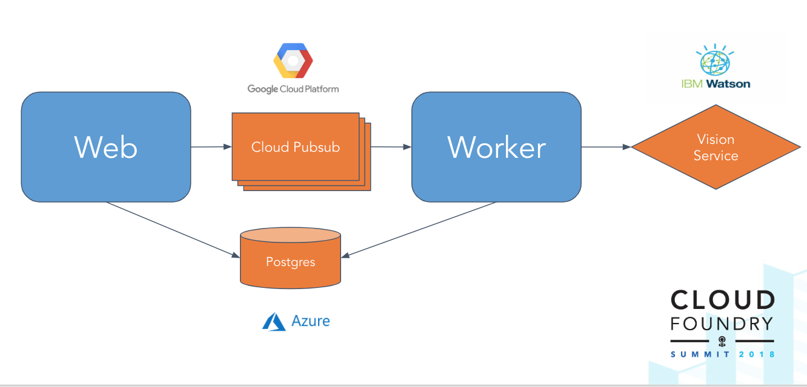

# One App, Two Platforms, Three Cloud Services
Example application used for `One App, Two Platforms, Three Cloud Services` talk at CF Summit Basel 2018.

The purpose of this demo is to show that the Open Service Broker API
allows the consumption of a variety of services from different cloud marketplaces.

### Architecture
The application consists of a web and worker app. The web app sends images to the worker for processing
over a message queue. The worker app uses a backing vision service to process the image and then stores
them on a shared database instance. The web app then reads these processed images for display back to the user.
 
We have chosen to use services from Google, Azure and IBM Cloud.



### Setup

#### Building docker images
```bash
# from the root of the repo
docker build -t servicesapi/web-app:latest . -f web-app/Dockerfile
docker build -t servicesapi/worker-app:latest . -f worker-app/Dockerfile
```

#### Broker setup

To enable the services in the marketplace we pushed three CF apps that allow access to the cloud
markplaces.
* [Google Cloud Platform proxy](https://github.com/cloudfoundry-incubator/gcp-broker-proxy)
* [IBM Cloud proxy](https://github.com/georgi-lozev/cf-broker-proxy)
* [Azure broker](https://github.com/Azure/open-service-broker-azure)

